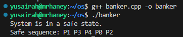

Banker's Algorithm - Deadlock Avoidance (Programming Assignment 2)

Student: Yusairah Haque 
Course: CS-33211
Environment: C++ on Linux/Unix (WSL used)

This program checks whether a system is in a safe or unsafe state using the Banker's algorithm. It uses information about processes, allocated resources, maximum demands, and available resources to determine if all processes can safely complete without causing a deadlock. It reads all required data from an external file called input.txt.

Program Description: 
    The program 
    - reads the current system snapshot from input.txt
    - calculates the need matrix
    - runs the banker's safety algorithm to check whether each process can finish with the currently available resources 
    - builds a safe sequence 
    - prints either: 
        - the safe sequence, or 
        - a message saying the system is not safe
    The assignment uses 5 processes (P0-P4) and 3 resource types (A, B, C). 

To Compile: 
    in a linux/unix environment run: g++ banker.cpp -o banker 
        which creates an executable named banker. 

To Run: 
    run ./banker 
    the program will automatically read input.txt which is in the same directory. 

Input File: 
    input.txt follows this structure: 
        n m 
        <allocation matrix: n rows, m columns>
        <maximum matrix: n rows, m columns>
        <available vector: 1 row, m columns>
    where, 
        n = number of processes (P0, P1, P2, P3, P4)
        m = number of resource types (A, B, C)
        allocation = current allocated resources 
        maximum = maximum resources a process may request 
        available = free resources in the system 
    Example Input: 
    5 3
    0 1 0
    2 0 0
    3 0 2
    2 1 1
    0 0 2
    7 5 3
    3 2 2
    9 0 2
    2 2 2
    4 3 3
    3 3 2

Program output: 
- if the system is safe then program prints: 
    System is in a safe state.
    Safe sequence: P1 P3 P4 P0 P2
- if the system is not safe, it prints: 
    System is not in a safe space.

Files that are included are: 
    - banker.cpp: C++ implementation
    - input.txt: system snapshot 
    - README.md: documentation 
    - image.png: screenshot of result

How the Algorithm works: 
    1. banker.cpp reads all matrices from input.txt.
    2. computes the need matrix using need = maximum - allocation 
    3. repeatedly searches for a process whose need <= available. 
    4. if that is found: 
        - marks the process as finished 
        - adds it to the safe sequence 
        - adds its allocation back to available
    5. this repeats until: 
        - all processes finish which means system is safe 
        - no process can run which means system is unsafe

Results:
    screenshot showing the safe state and sequence 
    

